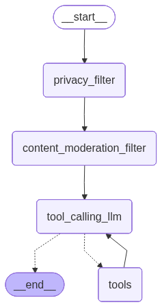

# Secured AI Agents with Privacy & Safety Filters  

🚀 An AI Agent system built with **LangGraph** + **Groq LLM** + **Tavily Search** + **ChromaDB**, enhanced with **Privacy Filters** (PII redaction) and **Safety Filters** (profanity/content moderation).
This project ensures responsible AI interactions by protecting sensitive user data and moderating harmful content.

## ✨ Features

### Privacy Filter 🛡️

Detects and redacts **PII** such as phone numbers, email addresses, credit card numbers, and names.

### Content Moderation Filter 🔒

Removes profanity and offensive/obfuscated words using regex + better-profanity.

### Conversation Memory with ChromaDB 📚

Stores conversations for retrieval-augmented responses.

### Tool Integration 🔧

Integrated with **Tavily Search** API for real-time web search.

### LLM with Safety Controls 🤖

Uses **Groq’s LLM** ***(openai/gpt-oss-120b)*** with tool binding.

### Interactive Chat UI 💬

Powered by **Gradio** for a clean AI Agent chat interface.

## 🛠️ Installation

Clone the repo and install dependencies:

git clone https://github.com/imran-sony/secured-ai-agent.git  
cd secured-ai-agent

### 🔑 Environment Variables

Set your API keys before running:

groq_api_key = "your_groq_api_key"  
tavily_api_key = "your_tavily_api_key"

### 🚀 Running the Project
1. Notebook

Run the Python notebook:

Secured_AI_Agent.ipynb

2. Gradio Web App

👉 The chatbot launches

## 🧩 System Workflow

The LangGraph pipeline consists of nodes:

**Privacy Filter** → Redacts sensitive data.

**Content Moderation Filter** → Censors profanity and unsafe text.

**Tool Calling LLM** → Uses Groq LLM with tools.

**Tavily Search Tool** → Provides web knowledge.

**ChromaDB Memory** → Saves conversation history.

The flow is compiled into a secure conversational agent.

